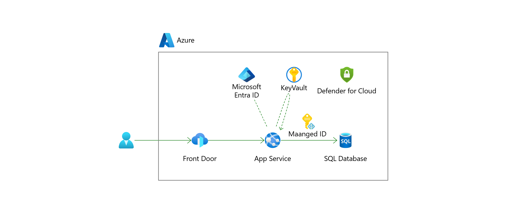

# Webinar Hands-On

## 目次

### 事前準備

1. [事前準備](preparation01.md)

### ハンズオン

1. [SQL DB 接続文字列の分離](exercise01.md)
1. [マネージドIDを使った SQL DB 接続](exercise02.md)
1. [App Service に OIDC 認証設定](exercise03.md)
1. [WAFの配置](exercise04.md)
1. [ネットワークの制限](exercise05.md)
1. [Defender for Cloud の設定](exercise06.md)
