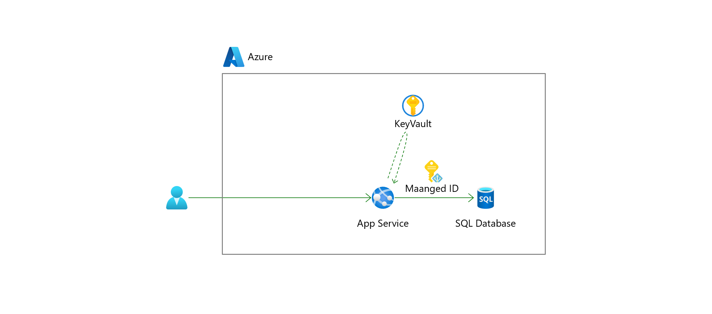

# Exercise2: マネージドIDを使った SQL DB 接続

## 【目次】



1. [SQL Database の認証設定変更](#sql-database-の認証設定変更)
1. [SQL Database に対するアクセス権設定](#sql-database-に対するアクセス権設定)
1. [接続文字列の変更](#接続文字列の変更)
1. [動作確認](#動作確認)


## SQL Database の認証設定変更

ID/Passwordを使った認証から MEID (旧 Azure AD) 認証を使った認証方式へ変更します。

1. SQL Server を開き、[設定]-[Azure Active Directory]を開く

1. 「管理者の設定」を選択

1. 自分自身を追加

1. 「Azure Active Directory 認証のみ」にチェックを入れる

1. 「保存」

クエリエディターで動作確認

1. SQL Database を開き、「クエリエディター」を開く

1. SQL Server 認証を使ってログインを試す

    →ログインできないことを確認

1. Active Directory 認証を使ってログインを試す

    →ログインできることを確認


## SQL Database に対するアクセス権設定

App Service に設定された マネージドID からアクセスできるよう、
SQL Databasee に対して App Service のアクセス権を設定する。

1. SQL Database を開き、「クエリエディター」を開く

1. 以下のクエリを実行

    ただし、 `<APPSERVICE_NAME>` 部分については作成した App Service 名に書き換えて実行する

    ```
    CREATE USER [<APPSERVICE_NAME>] FROM EXTERNAL PROVIDER;
    ALTER ROLE db_datareader ADD MEMBER [<APPSERVICE_NAME>];
    ALTER ROLE db_datawriter ADD MEMBER [<APPSERVICE_NAME>];
    ALTER ROLE db_ddladmin ADD MEMBER [<APPSERVICE_NAME>];
    ```

1. アクセス権付与されたことを以下のクエリで確認

    * ユーザーが追加されたことの確認

        ```
        SELECT
          name,
          type_desc,
          create_date,
          modify_date
        FROM
          sys.database_principals
        WHERE
          name = '<APPSERVICE_NAME>'
        ;
        ```

    * 権限付与されたことの確認

        ```
        SELECT
          USER_NAME(grantee_principal_id) AS user_name,
          class_desc AS class_name,
          OBJECT_NAME(major_id) AS object_name,
          permission_name
        FROM
          sys.database_permissions
        WHERE
          grantee_principal_id = USER_ID('<APPSERVICE_NAME>')
        ;
        ```

(*) 参考： 間違って追加してしまった場合は以下のコマンドでユーザー/権限を削除

```
DROP USER [<APPSERVICE_NAME>];
```


## 接続文字列の変更

キーコンテナーに登録された接続文字列を、 Azure AD 認証を使った接続文字列に変更

SQL Database への接続文字列の準備

1. SQL Database を開き、 [設定]-[接続文字列] を開く

1. 「ADO.NET (Active Directory passwordless authentication)」にある接続文字列を参考に以下のような接続文字列を作成、メモに控えておく

    接続文字列の最後にある `Active Directory Default` を `Active Directory MSI` に書き換える

    ```
    Server=tcp:<SQLSVR_NAME>.database.windows.net,1433;Initial Catalog=<SQLDB_NAME>; Encrypt=True; TrustServerCertificate=False; Connection Timeout=30; Authentication="Active Directory MSI";
    ```

キーコンテナーへ接続文字列を設定

1. キーコンテナーを開き、 [オブジェクト]-[シークレット] を開く

1. 作成済みの接続文字列用のシークレット（例： `SqlDb-Connection-String` ）を開く

1. 「新しいバージョン」を開き、以下を設定

    * アップロードオプション： `手動`
    * 名前： `SqlDb-Connection-String` （あらかじめ設定済み）
    * シークレット値： (前手順であらかじめ取得しておいたパスレス認証の接続文字列)

1. 新しいバージョンを開き、「シークレット識別子」をメモに控えておく

App Service のキーコンテナー参照設定を修正

1. App Service を開き、　[設定]-[構成] を開く

1. 接続文字列の `MSSQLDB` を、あらかじめ取得しておいたキーコンテナーの新しいバージョンの「シークレット識別子」を産所うするよう修正

    ```
    @Microsoft.KeyVault(SecretUri=<SECRET_URI>)
    ```

1. 変更が終わったら「保存」を押して反映、App Service を再起動


## 動作確認

1.　App Service を開き、 [概要]を開く

1. 「既定のドメイン」にあるドメイン名を控えておき、

    新しいブラウザで開く

1. 「ToDo」タブが開ければ設定完了


# 次の Exercise へ

* [App Service に OIDC 認証設定](exercise03.md)
