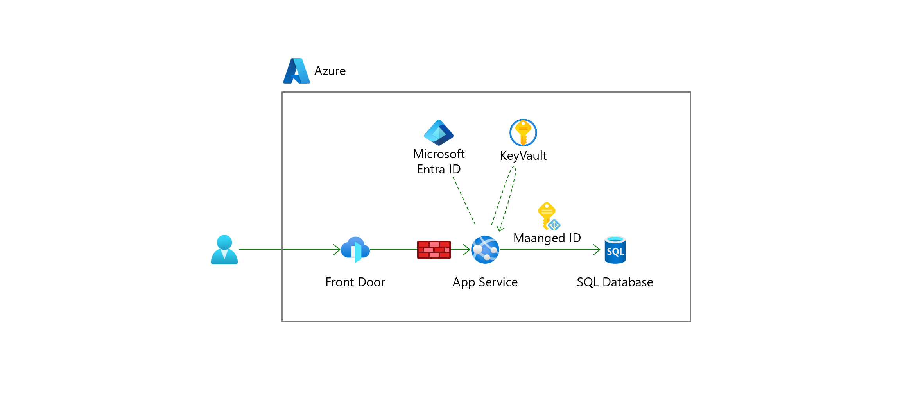

# Exercise5: ネットワークの制限

## 【目次】



1. [アクセス元の制限]()
1. [リダイレクト設定]()
1. [ヘルスチェックおよびプロキシ設定]()
1. [動作確認]()


## アクセス元の制限

1. App Service を開き、 [設定]-[ネットワーク] を開く

1. 「受信トラフィック」にある「アクセス制限」を開く

1. パブリックアクセスの制限を設定。

    * アプリのアクセス
      * パブリックアクセスを許可: `有効` （チェックされた状態）
    * サイトのアクセスとルール
        * メインサイト
            * 一致しないルールのアクション: `拒否`
            * 以下を追加
                * 名前: （任意。例: `AzureFrontDoorBackendInbound` ）
                * アクション: `許可`
                * 優先度: `300`
                * ソースの種類: `サービスタグ`
                * サービスタグ: `AzureFrontDoor.Backend`

1. 追加が終わったら「保存」。


## リダイレクト設定

1. App Service を開き、 [設定]-[認証] を開く

1. プロバイダーにある「Microsoft」のアプリ名を開く

1. [管理]-[認証] を開く

1. 「WebリダイレクトURI」にFrontDoorのエンドポイントURLを含む以下のようなURLを設定

    `<FRONTDOOR_ENDPOINT>` には Front Door のエンドポイントを入れる

    ```
    https://<FRONTDOOR_ENDPOINT>/.auth/login/aad/callback
    ```

1. 「保存」


## ヘルスチェックおよびプロキシ設定

1. リソースエクスプローラーを開く

    https://resources.azure.com/

1. App Service の `authsettingsV2` を開く

    ```
    subscriptions
    └"<YOUR_SUBSCRIPTION_NAME>"
      └resourceGroups
        └"<YOUR_ROESOURCE_GROUP_NAME>"
          └providers
            └Microsoft.Web
              └sites
                └"<YOUR_APPSERVICE_NAME>"
                  └config
                    └authsettingsV2
    ```

1. 「ヘルスチェックの除外」と「プロキシ」の2か所を修正して更新

    1. [Edit]を選択

    1. ヘルスチェックURL認証を除外

        ```
        {
          ... (省略) ...
          "properties": {
            ... (省略) ...
            "globalValidation": {
              "requireAuthentication": true,
              "unauthenticatedClientAction": "RedirectToLoginPage",
              "redirectToProvider": "azureactivedirectory",
              ### 以下を追加 ##################
              "excludedPaths": [
                  "/healthz"
              ],
              #### ここまで ###################
              "id": "(String)",
              "name": "(String)",
              "kind": "(String)",
              "type": "(String)",
              "properties": {
                "excludedPaths": [
                  {}      # ←ここは間違い
                ]
              }
            },
          ... (省略) ...
          }
        }
        ```

    1. 前段にプロキシが存在する設定に修正

        ```
        {{{
          ... (省略) ...
          "httpSettings": {
            "requireHttps": true,
            "routes": {
              "apiPrefix": "/.auth"
            },
            "forwardProxy": {
              ### 以下を修正 ##################
              "convention": "Standard"    # ← "NoProxy" から "Standard" へ変更
              #### ここまで ###################
            }
          }
          ... (省略) ...
        }}}
        ```

    1. モードが `Read/Write` になっていることを確認し、 `PUT` を実行


## 動作確認

1. App Service を開き、「概要」にある「既定のドメイン」を確認

1. 新規ブラウザを立ち上げ、確認した App Service のエンドポイントへアクセス

    * アクセス **できないこと** を確認

1. Front Door を開き、「概要」にある「エンドポイントのホスト名」を確認

1. 新規ブラウザを立ち上げ、確認した Front Door のエンドポイントへアクセス

    * アクセスできることを確認


# 次の Exercise へ

* [Defender for Cloud の設定](exercise06.md)
